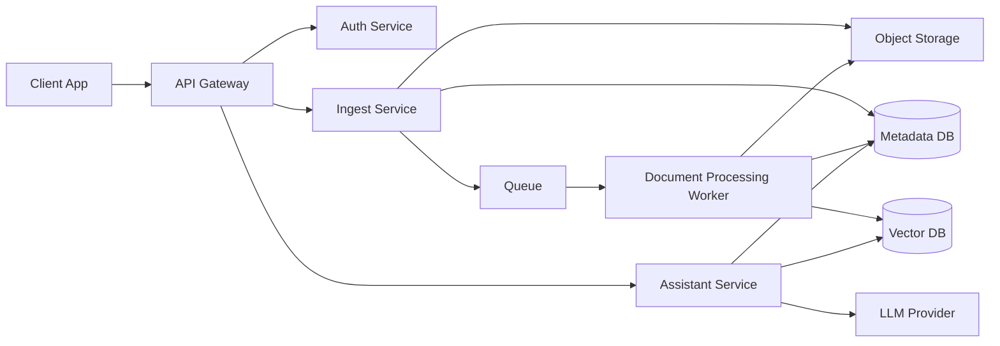
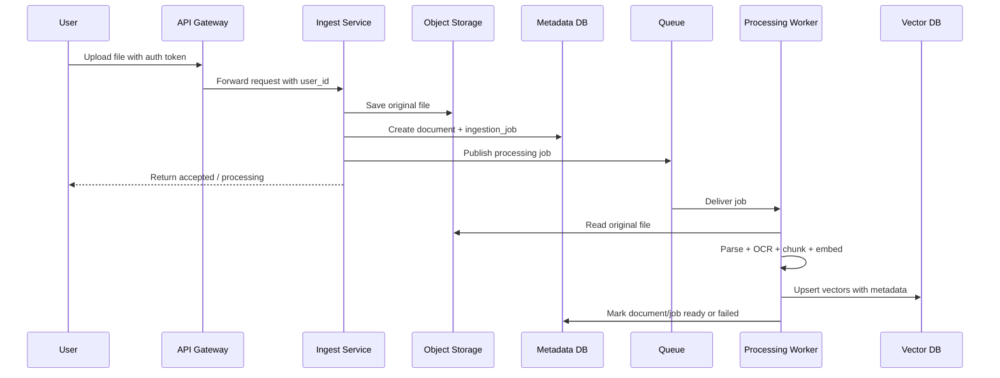
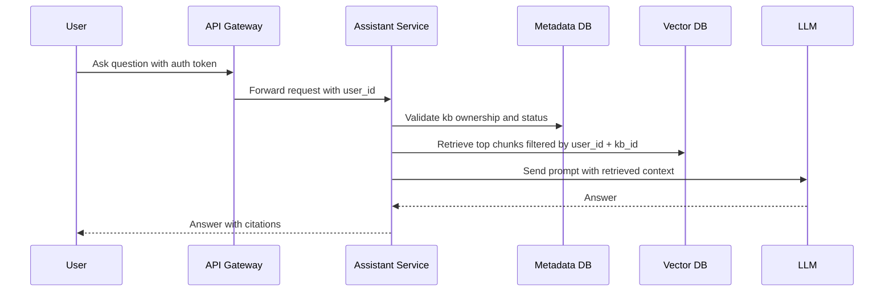

# Virtual Brain V1 Architecture

## Goal

Build a multi-tenant knowledge base and assistant system where:

- users can upload and update their own knowledge base
- the system ingests `txt`, `md`, `doc/docx`, `xls/xlsx`, `pdf`, and image files
- documents are parsed, chunked, embedded, and indexed into a vector database
- users can only query and manage their own knowledge base

---

## Recommended V1 Architecture

---

## Core Services

### 1. API Gateway

Responsibilities:

- unified entry for upload, document management, and chat
- token validation and request forwarding
- request-level rate limiting
- inject trusted `user_id` into downstream services

### 2. Auth Service

Responsibilities:

- user login and token issuing
- identity validation
- provide a trusted `user_id`

Why it is required:

- your original diagram did not explicitly show identity ownership
- multi-user KB isolation depends on trusted authentication

### 3. Ingest Service

Responsibilities:

- accept file uploads
- validate file type and size
- create knowledge base or attach documents to an existing KB
- store original file in object storage
- create document and ingestion job records in metadata DB
- enqueue async processing jobs

Notes:

- this service should not do heavy parsing inline
- keep it fast and non-blocking

### 4. Document Processing Worker

Responsibilities:

- load the original file from object storage
- route processing by file type
- extract raw text or table/image content
- run OCR for image-based files when needed
- chunk text
- generate embeddings
- write vectors to vector DB
- update ingestion status in metadata DB

Why a worker is better than a single processing API:

- parsing PDFs, images, and Office files is slow and failure-prone
- async retries and observability are much easier with workers

### 5. Object Storage

Responsibilities:

- store original uploaded files
- optionally store extracted intermediate artifacts

Why it is required:

- needed for reprocessing, versioning, debugging, and future OCR improvements

### 6. Metadata DB

Responsibilities:

- source of truth for users, KBs, documents, versions, and job states
- map chunks back to documents and versions
- support document lifecycle and UI status

Recommended database:

- Postgres for V1

### 7. Vector DB

Responsibilities:

- store embeddings and retrievable chunk metadata
- perform semantic search with metadata filters

Critical rule:

- every query must filter by `user_id` and `kb_id`

### 8. Assistant Service

Responsibilities:

- receive user questions
- validate KB ownership
- retrieve relevant chunks from vector DB
- assemble context
- call LLM
- return answer with citations

---

## Multi-Tenant Isolation

V1 should use logical multi-tenancy.

Required rules:

- every KB belongs to exactly one `user_id`
- every document belongs to one `kb_id`
- every chunk/vector stores `user_id`, `kb_id`, `document_id`, and `version`
- every ingest/update/delete/query request must be authorized against the current `user_id`
- assistant retrieval must always use metadata filters, not raw similarity search alone

Recommended V1 strategy:

- shared services
- shared vector DB collection or index
- metadata filtering for tenant isolation

This is simpler than creating one vector collection per user and is easier to operate in early versions.

---

## Recommended Metadata Model

### `users`

- `id`
- `email`
- `created_at`

### `knowledge_bases`

- `id`
- `user_id`
- `name`
- `status`
- `created_at`
- `updated_at`

### `documents`

- `id`
- `kb_id`
- `user_id`
- `filename`
- `file_type`
- `storage_path`
- `status`
- `current_version`
- `created_at`
- `updated_at`

### `document_versions`

- `id`
- `document_id`
- `version`
- `status`
- `checksum`
- `uploaded_at`
- `processed_at`

### `ingestion_jobs`

- `id`
- `user_id`
- `kb_id`
- `document_id`
- `document_version_id`
- `status`
- `error_message`
- `created_at`
- `updated_at`

### `chunks`

- `id`
- `user_id`
- `kb_id`
- `document_id`
- `document_version_id`
- `chunk_index`
- `text_preview`
- `source_page`
- `vector_id`

---

## Upload / Ingest Flow

---

## Query / RAG Flow

---

## File-Type Handling

Recommended V1 processing paths:

- `txt`, `md`: direct text extraction
- `doc`, `docx`: document parser, then normalized text extraction
- `xls`, `xlsx`: sheet-wise extraction, preserve sheet name and row references where possible
- `pdf`: direct text extraction first, OCR fallback for scanned pages
- images: OCR-first pipeline

Important:

- treat OCR as optional by file characteristics, not mandatory for every file
- store page number, sheet name, or image region metadata when available

---

## Chunking and Embedding Guidance

V1 recommendations:

- chunk at the document-processing layer, not in the upload API
- preserve metadata for source traceability
- use overlap to reduce context fragmentation
- store embedding model name and version with vectors or chunk metadata

Suggested chunk metadata:

- `user_id`
- `kb_id`
- `document_id`
- `document_version_id`
- `chunk_index`
- `source_page`
- `source_section`
- `embedding_model`

---

## Document Update Strategy

Support KB updates through versioned ingestion.

Recommended behavior:

- each new upload creates a new `document_version`
- old vectors for the prior version are marked inactive or deleted after successful re-indexing
- assistant queries only use the latest active version

This is safer than replacing vectors in place because it reduces partial-update risk.

---

## Minimum API Surface for V1

### Auth

- `POST /auth/login`
- `POST /auth/register`
- `GET /auth/me`

### Knowledge Base

- `POST /kbs`
- `GET /kbs`
- `GET /kbs/{kbId}`

### Documents / Ingest

- `POST /kbs/{kbId}/documents`
- `GET /kbs/{kbId}/documents`
- `GET /documents/{documentId}`
- `GET /ingestion-jobs/{jobId}`
- `DELETE /documents/{documentId}`
- `POST /documents/{documentId}/reindex`

### Assistant

- `POST /kbs/{kbId}/chat`

---

## Status Model

Use explicit statuses so the UI and retry flows are predictable.

Suggested document/job statuses:

- `uploaded`
- `processing`
- `ready`
- `failed`
- `deleting`
- `deleted`

---

## Risks in the Original Diagram

The original architecture was a solid starting point, but it was missing these production-critical pieces:

- no explicit auth or user identity layer
- no metadata database
- no object storage for original files
- no job status tracking
- no document versioning path for KB updates
- no explicit metadata filtering strategy for multi-tenant query isolation

---

## Recommended V1 Build Order

1. Auth + API Gateway
2. Metadata DB schema
3. KB and document management APIs
4. Upload to object storage
5. Queue + processing worker
6. Vector DB indexing
7. Assistant retrieval with strict tenant filtering
8. Citations and reindex/delete flows

---

## V1 Architecture Decision Summary

For V1, use:

- one shared application stack
- logical tenant isolation via `user_id` and `kb_id`
- object storage for raw files
- Postgres for metadata and job state
- async workers for parsing, OCR, chunking, and embedding
- vector DB only for retrieval, not as the primary system of record

This gives you a design that is simple enough to build now, but clean enough to scale into a real product.
